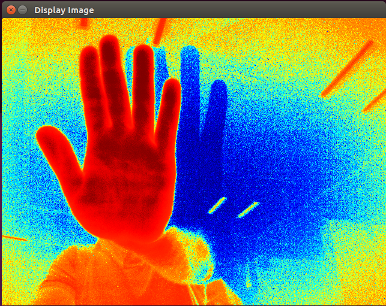

# Getting Started with OpenCV

## Displaying Color Frame

In this demo, you will acquire color frame from the RealSense camera and display it using OpenCV.
Before you start, make sure you have librealsense and OpenCV installed and working properly on your system.
Using the editor of your choise create BGR_sample.cpp and copy-paste the following code-snippet:

```cpp
// include the librealsense C++ header file
#include <librealsense2/rs.hpp>
#include <librealsense2/rsutils.hpp>

// include OpenCV header file
#include <opencv2/opencv.hpp>

using namespace std;
using namespace cv;
using namespace rs2;

int main()
{
    // Create a context object. This object owns the handles to all connected realsense devices
    context ctx;

    // Access the first available RealSense device
    device dev = ctx.query_devices().front();

    util::config config;
    config.enable_stream(RS2_STREAM_COLOR, 640, 480, 30, RS2_FORMAT_BGR8);
    auto stream = config.open(dev);

    frame_queue queue;
    // Start streaming
    stream.start(queue);

    // Camera warmup - Dropped several first frames to let auto-exposure stabilize
    for(int i = 0; i < 30; i++)
       queue.wait_for_frame();

    frame f = queue.wait_for_frame();
    // Creating OpenCV Matrix from a color image
    Mat color(Size(640, 480), CV_8UC3, (void*)f.get_data(), Mat::AUTO_STEP);

    // Display in a GUI
    namedWindow("Display Image", WINDOW_AUTOSIZE );
    imshow("Display Image", color);

    waitKey(0);

    return 0;
}
```

Compile and run the application from terminal using the following command line:

```shell
g++ -std=c++11 BGR_sample.cpp -lrealsense2 –lopencv_core -lopencv_highgui -o BGR && ./BGR
```

**Result:**


## Displaying Infrared Frame

Displaying Infrared and Depth data is not very different from Color data. Infrared frame is a single channel, 8 bits-per-pixel image.
Copy the following code snippet into IR_sample.cpp:

```cpp
// include the librealsense C++ header file
#include <librealsense2/rs.hpp>
#include <librealsense2/rsutils.hpp>

// include OpenCV header file
#include <opencv2/opencv.hpp>

using namespace std;
using namespace cv;
using namespace rs2;

int main()
{
    // Create a context object. This object owns the handles to all connected realsense devices
    context ctx;

    // Access the first available RealSense device
    device dev = ctx.query_devices().front();

    // Simultaneously open depth and infrared streams
    dev.open({{ RS2_STREAM_INFRARED, 640, 480, RS2_FORMAT_Y8,  30 },
              { RS2_STREAM_DEPTH,    640, 480, RS2_FORMAT_Z16, 30 }});

    // Start streaming
    frame_queue depth_queue, ir_queue;
    dev.start(RS2_STREAM_DEPTH, depth_queue);
    dev.start(RS2_STREAM_INFRARED, ir_queue);

    // Camera warmup - Dropped frames to allow stabilization
    for(int i = 0; i < 40; i++)
        ir_queue.wait_for_frame();

    frame ir_frame = ir_queue.wait_for_frame();
    // Creating OpenCV matrix from IR image
    Mat ir(Size(640, 480), CV_8UC1, (void*)ir_frame.get_data(), Mat::AUTO_STEP);

    // Apply Histogram Equalization
    equalizeHist( ir, ir );
    applyColorMap(ir, ir, COLORMAP_JET);

    // Display the image in GUI
    namedWindow("Display Image", WINDOW_AUTOSIZE );
    imshow("Display Image", ir);

    waitKey(0);

    return 0;
}
```

Compile and run the program from the terminal, with the following command:

```shell
g++ -std=c++11 IR_sample.cpp -lrealsense2 -lopencv_core -lopencv_omgproc -lopencv_contrib -o ir && ./ir
```

**Result :**


